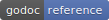

# ivg

    import "github.com/reactivego/ivg"

[](https://pkg.go.dev/github.com/reactivego/ivg?tab=doc)
[](https://godoc.org/github.com/reactivego/ivg)

[Gio](https://gioui.org) (immediate mode GUI in Go) uses [IconVG](https://golang.org/x/exp/shiny/iconvg) (binary format for simple vector graphic icons).
This code is a refactoring of the IconVG code. It removes the need for rendering to an intermediate RGBA image. Instead it uses Gio `clip.Path` functionality.

The name of the *IconVG* package has been changed to *ivg* so we don't confuse people about what's what.

The most important changes w.r.t. the original IconVG code are:

1. Separate code into packages with a clear purpose and responsibility for better cohesion and less coupling.
2. Split icon encoding into `encode` and `generate` package.
3. SVG gradient and path support is now part of `generate` package.
4. Rename `Rasterizer` to `Renderer` and place it in the `render` package.
5. Move `Destination` interface into root `ivg` package.
6. Make both `Encoder` and `Renderer` implement `Destination`.
7. Make both `Decoder` and `Generator` use only `Destination` interface.
8. `Generator` can now directly render by plugging in a `Renderer` (very useful).
9. `Encoder` can be plugged directly into a `Decoder` (useful for testing).
10. Abstract away rasterizing into a seperate package `raster`
    - Declare interface `Rasterizer`.
    - Declare interface `GradientConfig` implemented by `Renderer`.
11. Create a rasterizer using "golang.org/x/image/vector" in directory `raster/vec`
12. Create a rasterizer using "gioui.org/op/clip" in directory `raster/gio`
    - Special case for `GradientConfig`, selectively sample gradient only inside path bounds.
14. Create examples in the `example` folder.
    - `actioninfo` generate an icon on the fly, render it and cache the result, [see below](#example-actioninfo).
    - `cowbell` exposes rendering differences between gio and vector rasterizer (click to switch rasterizer).
    - `favicon` exposes rendering difference between gio and vector rasterizer (click to switch rasterizer).
    - `gradient` shows speed advantage of gio over vector rasterizer for gradient rendering (click to switch rasterizer).
    - `icons` renders golang.org/x/exp/shiny/materialdesign/icons (click to switch rasterizer).
    - `playarrow` simplest example of rendering an icon, [see below](#example-playarrow).

## Example PlayArrow

Simplest example of rendering an icon from an .ivg file stored in a slice of bytes.

```go
package main

import (
    "image/color"
    "log"
    "os"

    "gioui.org/app"
    "gioui.org/f32"
    "gioui.org/io/system"
    "gioui.org/op"
    "gioui.org/unit"

    "github.com/reactivego/ivg/icon"
)

func main() {
    go PlayArrow()
    app.Main()
}

func PlayArrow() {
    window := app.NewWindow(
        app.Title("IVG - PlayArrow"),
        app.Size(unit.Dp(768), unit.Dp(768)),
    )
    var ops = new(op.Ops)
    for event := range window.Events() {
        if frame, ok := event.(system.FrameEvent); ok {
            ops.Reset()
            rect := f32.Rect(0, 0, float32(frame.Size.X), float32(frame.Size.Y))
            blue := color.RGBA{0x21, 0x96, 0xf3, 0xff}
            if callOp, err := icon.FromData(AVPlayArrow, blue, rect, icon.AspectMeet, icon.Mid, icon.Mid, icon.GioRasterizer); err == nil {
                callOp.Add(ops)
            } else {
                log.Fatal(err)
            }
            frame.Frame(ops)
        }
    }
    os.Exit(0)
}

// ACPlayArrow was taken from "golang.org/x/exp/shiny/materialdesign/icons"
var AVPlayArrow = []byte{
    0x89, 0x49, 0x56, 0x47, 0x02, 0x0a, 0x00, 0x50, 0x50, 0xb0, 0xb0, 0xc0, 0x70, 0x64, 0xe9, 0xb8,
    0x20, 0xac, 0x64, 0xe1,
}

```
## Example ActionInfo

Generating the .ivg byte for an icon on the fly and then rendering it. Rendering operations are cached in an icon cache.

The function ActionInfoData() is called once to programatically generate an .ivg byte slice using the following pipeline:
```
Generator -> Encoder
```
The resulting bytes are stored for later rendering during a system.FrameEvent.

When the icon needs to be rendered, call the icon.Cache FromData method with the .ivg data bytes and additional arguments.
The icon cache uses the following pipeline to render the icon.
 
```
Decoder -> Renderer -> Rasterizer
```
The cache stores the resulting op.CallOp along with the parameters used for rendering.

```go
package main

import (
    "image/color"
    "log"
    "os"

    "gioui.org/app"
    "gioui.org/f32"
    "gioui.org/io/system"
    "gioui.org/op"
    "gioui.org/unit"

    "github.com/reactivego/ivg"
    "github.com/reactivego/ivg/encode"
    "github.com/reactivego/ivg/generate"
    "github.com/reactivego/ivg/icon"
)

func main() {
    go ActionInfo()
    app.Main()
}

func ActionInfo() {
    window := app.NewWindow(
        app.Title("IVG - ActionInfo"),
        app.Size(unit.Dp(768), unit.Dp(768)),
    )

    actionInfoData, err := ActionInfoData()
    if err != nil {
        log.Fatal(err)
    }

    var ops = new(op.Ops)
    cache := icon.NewCache(icon.GioRasterizer)
    blue := color.RGBA{0x21, 0x96, 0xf3, 0xff}
    for next := range window.Events() {
        if frame, ok := next.(system.FrameEvent); ok {
            ops.Reset()
            rect := f32.Rect(0, 0, float32(frame.Size.X), float32(frame.Size.Y))
            if callOp, err := cache.FromData(actionInfoData, blue, rect, icon.AspectMeet, icon.Mid, icon.Mid); err == nil {
                callOp.Add(ops)
            } else {
                log.Fatal(err)
            }
            frame.Frame(ops)
        }
    }
    os.Exit(0)
}

// ActionInfoData generates ivg data bytes on the fly for the ActionInfo icon.
func ActionInfoData() ([]byte, error) {
    e := &encode.Encoder{}
    g := &generate.Generator{Destination: e}
    g.Reset(ivg.ViewBox{0, 0, 48, 48}, &ivg.DefaultPalette)
    g.SetPathData("M24 4C12.95 4 4 12.95 4 24s8.95 20 20 20 20-8.95 "+
        "20-20S35.05 4 24 4zm2 30h-4V22h4v12zm0-16h-4v-4h4v4z", 0, false)
    return e.Bytes()
}
```

# Example Cowbell

Cowbell uses the following pipeline to programatically render a vector image of a Cowbell.

```
Generator -> Renderer -> Rasterizer
```
This example hooks up the generator directly to the renderer and forgoes the Encoder -> Decoder stages.


The rendering takes relatively long because of the gradients that need to be generated.

## Acknowledgement

This code is base on [golang.org/x/exp/shiny/iconvg](https://github.com/golang/exp/tree/master/shiny/iconvg).

## License

Everything under the raster folder is Unlicense OR MIT (whichever you prefer). See file [raster/LICENSE](raster/LICENSE).

All the other code is is governed by a BSD-style license that can be found in the [LICENSE](LICENSE) file.
